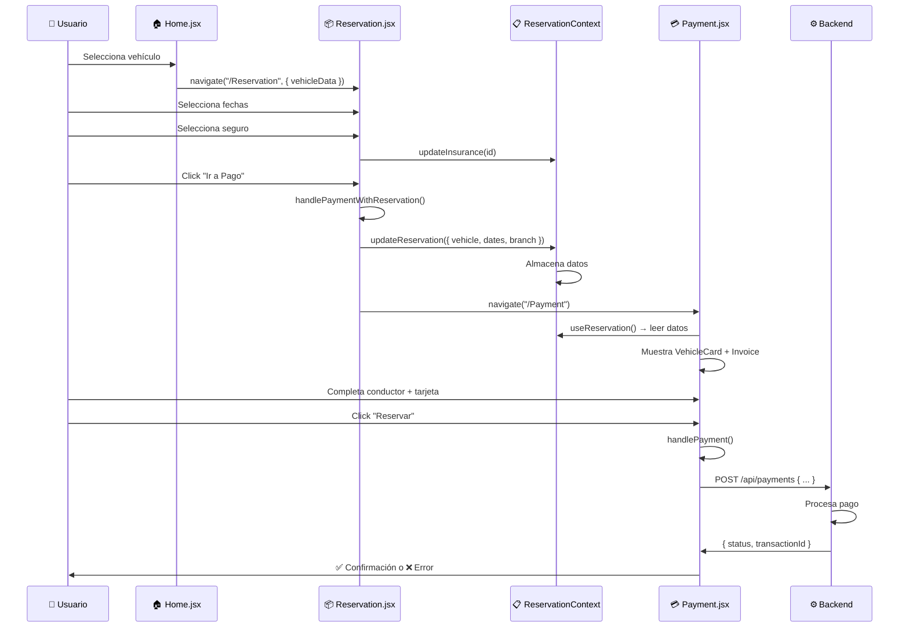
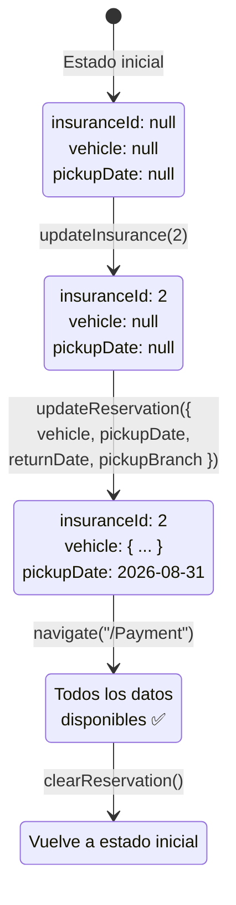
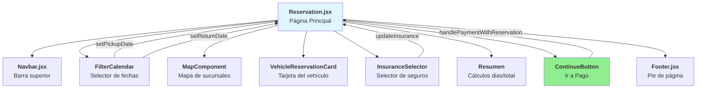
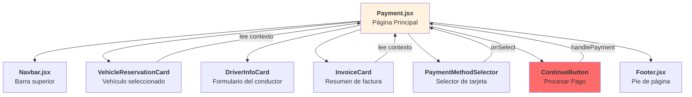
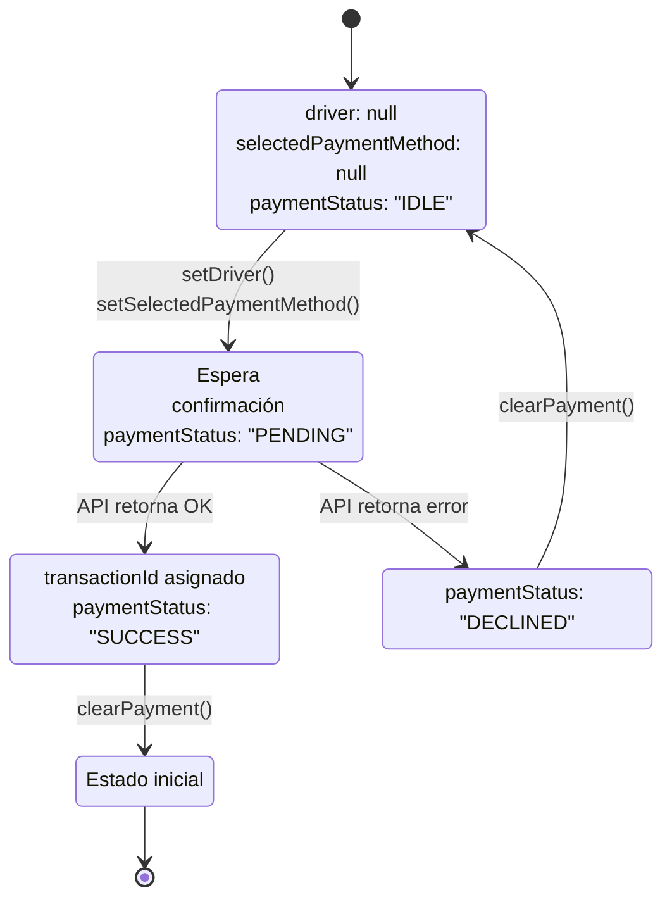
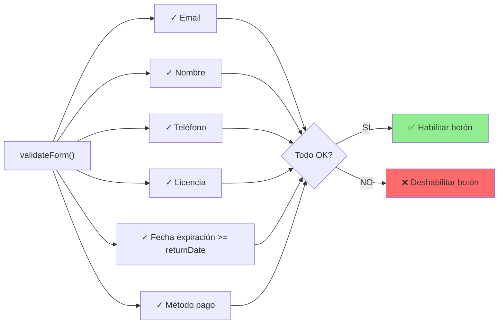
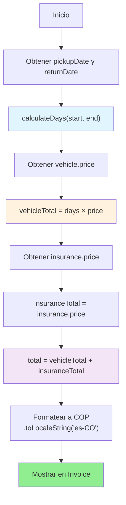
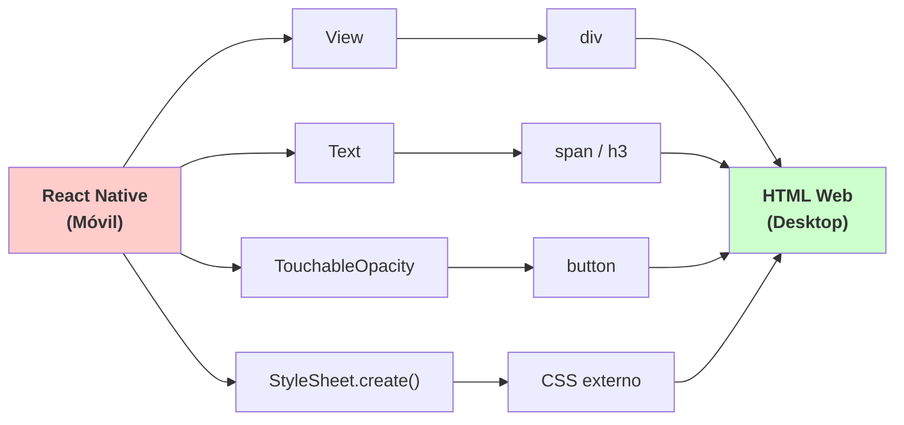
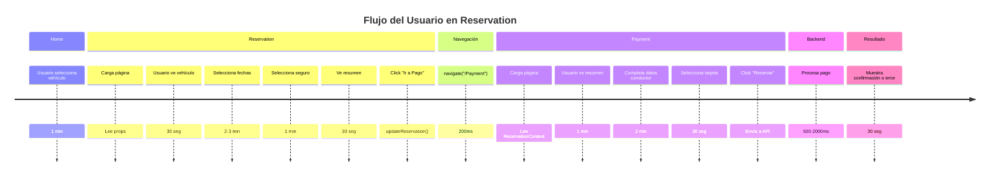
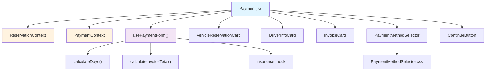

# 📊 Diagramas de Flujo - Cambios 31-08-2026

## 1️⃣ Flujo Completo: Home → Payment



---

## 2️⃣ Flujo de Datos: ReservationContext



---

## 3️⃣ Composición de Componentes - Reservation Page



---

## 4️⃣ Composición de Componentes - Payment Page



---

## 5️⃣ Estados del PaymentContext



---

## 6️⃣ Validaciones en usePaymentForm



---

## 7️⃣ Cálculo del Total



---

## 8️⃣ Cambio: React Native → Web



---

## 9️⃣ Ciclo de Vida: Reservation → Payment



---

## 🔟 Árbol de Dependencias: Payment Feature



---

## 1️⃣1️⃣ Mapa Mental: Cambios del Día

```mermaid
mindmap
  root((Cambios 31-08-2026))
    🔧 Bug Fixes
      React Native conflict
        Convertir PaymentMethodSelector
        Crear PaymentMethodSelector.css
        Actualizar vite.config.js
        Cambiar tipo ImageSourcePropType
    
    ✨ Features
      Payment Feature
        Actualizar Payment.jsx
        Actualizar InvoiceCard.jsx
        Leer de ReservationContext
      Reservation Feature
        Actualizar ReservationContext
        Nueva función updateReservation()
        Actualizar Reservation.jsx
        Nueva función handlePaymentWithReservation()
    
    📚 Documentación
      FEATURE_PAYMENT_FLOW.md
      FEATURE_RESERVATION_FLOW.md
      BUGFIX_REACT_NATIVE_WEB_CONFLICT.md
      RESUMEN_CAMBIOS_31-08-2026.md
      DIAGRAMAS_FLUJO.md
```

---

## 1️⃣2️⃣ Comparación: Antes vs Después

### ReservationContext

**ANTES:**
```
┌─────────────────────┐
│ ReservationContext  │
├─────────────────────┤
│ insuranceId: null   │
└─────────────────────┘
```

**DESPUÉS:**
```
┌─────────────────────────────────┐
│ ReservationContext              │
├─────────────────────────────────┤
│ insuranceId: null               │
│ vehicle: null          ⭐ NEW   │
│ pickupDate: null       ⭐ NEW   │
│ returnDate: null       ⭐ NEW   │
│ pickupBranch: null     ⭐ NEW   │
│                                 │
│ updateReservation()    ⭐ NEW   │
└─────────────────────────────────┘
```

### PaymentMethodSelector

**ANTES (React Native):**
```jsx
<TouchableOpacity
  style={styles.methodCard}
  onPress={() => onSelect?.(method)}
>
  <Text>{method.type}</Text>
</TouchableOpacity>
```

**DESPUÉS (Web):**
```jsx
<button
  className="payment-method-card"
  onClick={() => onSelect?.(method)}
>
  <span>{method.type}</span>
</button>
```

---

## Notas Importantes

✅ Todos los diagramas son editables en Mermaid  
✅ Los flujos están documentados en archivos .md separados  
✅ Los colores indican propósito (azul = lectura, naranja = entrada, verde = éxito, rojo = error)

