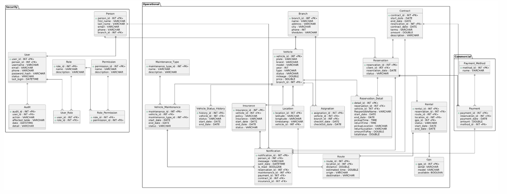

# Manual Técnico – RentaMovil

## 1. Descripción general del sistema

### Nombre del proyecto

**RentaMovil**

### Descripción general

RentaMovil es un sistema orientado a la **gestión y alquiler de vehículos**, desarrollado con el propósito de facilitar el proceso de consulta, selección y reserva de vehículos por parte de los usuarios.

El sistema permite gestionar información relacionada con los vehículos disponibles para alquiler, usuarios, reservas y demás procesos asociados al servicio de renta de vehículos. Además, el proyecto contempla la integración de funcionalidades relacionadas con la ubicación y seguimiento mediante GPS, permitiendo mejorar el control y la gestión de los vehículos.

### Tipo de aplicación

El proyecto está compuesto por una solución **multiplataforma**, que contempla:

* **Aplicación web:** desarrollada para permitir a los usuarios acceder al sistema desde un navegador ademas comtempla el menu de administradores.
* **Aplicación móvil:** desarrollada para dispositivos móviles.

---

## 2. Tecnologías usadas

### Frontend Web

El frontend web de RentaMovil está desarrollado utilizando tecnologías modernas para la construcción de interfaces dinámicas e interactivas.

* **Lenguaje:** JavaScript
* **Framework/Biblioteca:** React
* **Herramienta de construcción:** Vite
* **Versión de React:** 19.2.4
* **Versión de React DOM:** 19.2.4
* **Enrutamiento:** React Router DOM 7.14.0
* **Formularios:** React Hook Form
* **Iconos:** React Icons
* **Mapas:** Leaflet y React Leaflet
* **Gráficas:** Recharts
* **Animaciones:** GSAP
* **Internacionalización:** i18next y React-i18next
* **Carga de archivos:** React Dropzone
* **Filtros de precio:** RC Slider

El frontend web utiliza **React** para construir la interfaz mediante componentes reutilizables y **Vite** como herramienta de desarrollo y compilación del proyecto.

### Aplicación móvil

El proyecto también contempla una aplicación móvil desarrollada con:

* **Framework:** React Native
* **Plataforma de desarrollo:** Expo
* **Versión de Expo:** 54.0.33
* **Versión de React:** 19.1.0
* **Navegación:** React Navigation
* **Iconos:** Expo Vector Icons
* **Selector de fechas:** React Native DateTimePicker
* **Selector de opciones:** React Native Picker

La aplicación móvil permite adaptar las funcionalidades principales del sistema a dispositivos Android y otros entornos compatibles con React Native y Expo.

### Backend

**Pendiente de implementación/documentación.**

> Aun sin desarrollarse

### Base de datos

El proyecto contempla el uso de una base de datos relacional para la gestión de la información del sistema.

Durante el desarrollo del proyecto se han trabajado tecnologías como:

* **SQL Server**
* **MySQL**

### Control de versiones

Para el control de versiones y almacenamiento del código fuente se utiliza:

* **Git**
* **GitHub**

El código fuente del proyecto se gestiona mediante repositorios Git, permitiendo llevar un control de los cambios realizados durante el desarrollo y facilitar el trabajo colaborativo.

https://github.com/nicolerv18/RentaMovil

### Herramientas de diseño y modelado

Para el diseño y documentación del sistema se utilizan herramientas de modelado y diagramación, como:

* **Draw.io / diagrams.net**
* Herramientas para diseño de **MER y diagramas de base de datos**
* Herramientas de diseño de interfaces y prototipos, según corresponda al desarrollo del proyecto.

---

## 3. Arquitectura

### Arquitectura del frontend

Para el desarrollo del frontend se utiliza una arquitectura **orientada a componentes (component-driven)**, combinada con una organización **basada en funcionalidades (feature-based)**.

Este enfoque consiste en agrupar, dentro de una misma carpeta o módulo, todos los elementos relacionados con una funcionalidad o página específica del sistema: componentes, hooks, estilos, servicios y pruebas correspondientes a esa funcionalidad.

**Ventajas de este enfoque:**

* **Mantenibilidad:** al estar todo lo relacionado con una funcionalidad en un mismo lugar, es más fácil localizar y modificar el código.
* **Escalabilidad:** permite agregar nuevas funcionalidades sin afectar el resto del sistema, ya que cada módulo es independiente.
* **Colaboración:** distintos desarrolladores pueden trabajar sobre diferentes funcionalidades sin generar conflictos significativos en el código.
* **Reutilización:** los componentes pequeños y bien definidos pueden reutilizarse entre distintas funcionalidades del sistema.

**Ejemplo de organización feature-based aplicado a RentaMovil:**

```text
src/
├── features/
│   ├── vehiculos/
│   │   ├── components/
│   │   ├── hooks/
│   │   ├── services/
│   │   └── styles/
│   │
│   ├── reservas/
│   │   ├── components/
│   │   ├── hooks/
│   │   ├── services/
│   │   └── styles/
│   │
│   └── auth/
│       ├── components/
│       ├── hooks/
│       ├── services/
│       └── styles/
│
├── shared/
│   ├── components/
│   ├── hooks/
│   └── utils/
│
└── App.jsx
```

### Patrón arquitectónico general

A nivel de todo el sistema, se contemplan las siguientes capas:

* **Capa de presentación:** interfaces web y móvil, organizadas mediante componentes y features.
* **Capa de servicios:** procesamiento de las operaciones del sistema.
* **Capa de lógica de negocio:** aplicación de reglas y validaciones.
* **Capa de persistencia:** comunicación con la base de datos.
* **Capa de datos:** almacenamiento de la información.

---

## 4. Estructura del proyecto

La estructura general del proyecto se encuentra dividida en diferentes aplicaciones y componentes.

Una estructura conceptual del proyecto es:

```text
RentaMovil/
│
├── frontend/
│   ├── src/
│   │   ├── assets/
│   │   ├── components/
│   │   ├── pages/
│   │   ├── hooks/
│   │   ├── services/
│   │   ├── utils/
│   │   ├── routes/
│   │   └── ...
│   │
│   ├── public/
│   ├── package.json
│   └── vite.config.js
│
├── mobile/
│   ├── src/
│   │   ├── components/
│   │   ├── screens/
│   │   ├── navigation/
│   │   ├── services/
│   │   └── ...
│   │
│   ├── package.json
│   └── app.json
│
├── backend/
│   └── Pendiente
│
└── README.md
```

### Frontend Web

Dentro del frontend se manejan diferentes carpetas para organizar el código según su responsabilidad.

* **components:** contiene componentes reutilizables de la interfaz.
* **pages:** contiene las diferentes páginas o vistas del sistema.
* **hooks:** contiene hooks personalizados utilizados para encapsular lógica reutilizable.
* **services:** contiene funciones encargadas de la comunicación con servicios externos o API.
* **utils:** contiene funciones auxiliares y utilidades generales.
* **routes:** contiene la configuración de navegación y rutas de la aplicación.
* **assets:** contiene imágenes, iconos y otros recursos estáticos.

### Aplicación móvil

La aplicación móvil sigue una estructura similar, adaptada a React Native y Expo.

Se utilizan componentes reutilizables, pantallas, navegación y servicios para mantener una organización modular.

### Backend

**Pendiente de implementación/documentación.**

---

## 5. Base de datos

### Nombre de la base de datos

**RentaMovil**



### Descripción

La base de datos tiene como objetivo almacenar y gestionar la información necesaria para el funcionamiento del sistema de alquiler de vehículos.

Entre la información que debe manejar el sistema se encuentra:

* Usuarios.
* Roles.
* Permisos.
* Vehículos.
* Reservas.
* Pagos.
* Ubicación de vehículos.
* Información relacionada con GPS.
* Estados de los procesos.

### Entidades principales

De acuerdo con la lógica del sistema, las entidades principales pueden organizarse alrededor de:

* **Usuario:** almacena la información de las personas que utilizan el sistema.
* **Rol:** define el tipo de usuario dentro de la plataforma.
* **Permiso:** representa las acciones que pueden realizar los usuarios.
* **Vehículo:** almacena la información de los vehículos disponibles para alquiler.
* **Reserva:** registra la solicitud de un usuario para reservar un vehículo.
* **Pago:** registra la información relacionada con los pagos.
* **Ubicación:** almacena información relacionada con la posición de los vehículos.
* **GPS:** permite gestionar la información relacionada con el seguimiento y localización de los vehículos.

> La estructura definitiva de tablas, campos, tipos de datos, claves primarias, claves foráneas, restricciones, procedimientos y triggers deberá actualizarse de acuerdo con el modelo final implementado.

---

## 6. Módulos técnicos

El sistema RentaMovil se encuentra organizado en diferentes módulos funcionales.

### Módulo de autenticación

Permite controlar el acceso de los usuarios al sistema.

Contempla funcionalidades relacionadas con:

* Inicio de sesión.
* Validación de credenciales.
* Control de acceso.
* Gestión de sesiones.

### Módulo de vehículos

Permite gestionar la información de los vehículos disponibles para alquiler.

Puede incluir:

* Registro de vehículos.
* Consulta de vehículos.
* Actualización de información.
* Estado de disponibilidad.
* Características del vehículo.
* Imágenes.


### Módulo de reservas

Permite gestionar las solicitudes de reserva realizadas por los usuarios.

Este módulo contempla el proceso de:

```text
Consulta de vehículo
       ↓
Selección de vehículo
       ↓
Selección de fechas
       ↓
Solicitud de reserva
       ↓
Confirmación
```

### Módulo de ubicación y GPS

Este módulo está orientado al seguimiento y localización de los vehículos.

Su objetivo es permitir la integración de funcionalidades relacionadas con:

* Ubicación del vehículo.
* Seguimiento GPS.
* Visualización de ubicación en mapas.
* Control de recorrido.

En el frontend web se utiliza **Leaflet y React Leaflet** para las funcionalidades relacionadas con mapas.

### Módulo de administración

Está orientado a los usuarios encargados de administrar la plataforma.

Puede incluir:

* Gestión de usuarios.
* Gestión de vehículos.
* Gestión de reservas.
* Gestión de alquileres.
* Control de estados.
* Gestión de información general del sistema.

## Módulo de notificaciones

Está orientado a las notificaciones que reciben los usuarios y administradores en la plataforma.

Puede incluir:

* Notificaciones de confirmación de reservas.
* Notificaciones de cancelación de reservas.
* Notificaciones de Pago realizado.
* Notificaciones de Pago pendiente.


---

## 7. Endpoints / API

**Pendiente de implementación y documentación del Backend.**

La documentación definitiva se realizará una vez se encuentre implementado el backend y se hayan definido las rutas correspondientes.

---

## 8. Seguridad

La seguridad del sistema está orientada a proteger la información de los usuarios y controlar el acceso a las diferentes funcionalidades.

### Autenticación

El sistema contempla un mecanismo de autenticación para permitir que los usuarios registrados puedan acceder a sus funcionalidades correspondientes.

El método definitivo de autenticación dependerá de la implementación final del backend.


### Roles y permisos

El sistema contempla la utilización de roles para diferenciar los niveles de acceso de los usuarios.

Entre los roles contemplados se encuentran:

* **Administrador:** encargado de gestionar y administrar la plataforma.
* **Usuario/Cliente:** puede consultar vehículos y realizar procesos relacionados con reservas y alquileres.

### Validaciones

El sistema contempla validaciones tanto en el frontend como en el backend.

Estas validaciones buscan garantizar:

* Campos obligatorios.
* Formatos correctos.
* Validación de datos ingresados.
* Control de información inválida.
* Validación de disponibilidad.
* Control de acceso a funcionalidades.

---

## 9. Mantenimiento

Para garantizar el correcto funcionamiento y mantenimiento de RentaMovil se recomienda realizar las siguientes actividades:

### Control de versiones

Mantener el código fuente actualizado en el repositorio Git, utilizando ramas para organizar el desarrollo de nuevas funcionalidades y correcciones.

### Copias de seguridad

Realizar copias de seguridad periódicas de la base de datos para evitar la pérdida de información.

### Actualización de dependencias

Mantener actualizadas las dependencias utilizadas por React, React Native, Expo y demás tecnologías, verificando previamente la compatibilidad entre versiones.

### Documentación

Mantener actualizada la documentación técnica del proyecto cada vez que se agreguen nuevos módulos, funcionalidades, endpoints o cambios en la estructura de la base de datos.

### Monitoreo

Verificar periódicamente el correcto funcionamiento de:

* Aplicación web.
* Aplicación móvil.
* Servicios del backend.
* Base de datos.
* Servicios relacionados con GPS.
* Integraciones externas.

### Gestión de errores

Registrar y analizar los errores encontrados durante el funcionamiento del sistema para facilitar su corrección y prevenir que vuelvan a ocurrir.

### Despliegue

Los procesos de construcción y despliegue deben realizarse de manera controlada, verificando previamente que las nuevas versiones hayan sido probadas correctamente.

