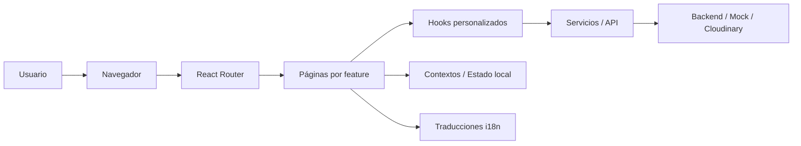

# Manual técnico — Frontend Web de RentaMóvil

## 1. Descripción técnica del sistema

El frontend web de RentaMóvil es una aplicación de tipo Single Page Application (SPA) desarrollada con React y Vite. Su propósito es ofrecer una interfaz para la gestión y reserva de vehículos, así como para las operaciones de autenticación, pagos, notificaciones y administración de flota.

La aplicación está organizada por funcionalidades (feature-based), lo que permite separar claramente la lógica y los componentes de cada módulo: autenticación, vehículos, reservas, pagos, administración y notificaciones.

### Objetivo del sistema
- Permitir a los usuarios interactuar con el sistema de renta de vehículos desde un navegador.
- Gestionar procesos como login, registro, cambio de contraseña, reservas y pagos.
- Brindar una experiencia multiidioma y con soporte para cambio de tema.
- Servir como capa visual para el backend o para servicios simulados en desarrollo.

---

## 2. Tecnologías utilizadas

### Frontend
- React 19.2.4
- Vite 8.0.1
- React Router DOM 7.14.0
- JavaScript / JSX
- CSS modular y hojas de estilo globales

### Librerías principales
- react-i18next + i18next para internacionalización
- react-hook-form para formularios
- react-icons para iconografía
- leaflet + react-leaflet para mapas
- recharts para gráficas
- react-dropzone para carga de archivos
- gsap para animaciones
- rc-slider para controles deslizantes

### Herramientas de desarrollo
- ESLint para análisis estático
- Vite dev server para ejecución local
- Git para control de versiones

### Integraciones externas
- Cloudinary para carga de imágenes de vehículos
- OpenStreetMap para mapas interactivos

---

## 3. Arquitectura del sistema

El proyecto sigue una arquitectura basada en componentes y organizada por características. Se combina una estructura por módulos funcionales con hooks reutilizables, servicios específicos y componentes compartidos.

### Principios de arquitectura
- Component-driven: cada pantalla se compone de componentes reutilizables.
- Feature-based: cada funcionalidad tiene su propio conjunto de carpetas.
- Separación de responsabilidades: UI, lógica, servicios y utilidades están aislados.
- Internacionalización centralizada mediante archivos JSON.

### Diagrama general



### Flujo de ejecución típico
1. El usuario accede a una ruta definida en React Router.
2. El componente de página se renderiza.
3. Los hooks gestionan el estado y la lógica de negocio.
4. Los servicios consumen datos desde un backend real o desde mocks.
5. Los textos se resuelven mediante el sistema de traducción.

---

## 4. Estructura del proyecto

La estructura principal del frontend web es la siguiente:

```text
src/
├── App.jsx
├── main.jsx
├── index.css
├── App.css
├── assets/
├── contexts/
├── features/
│   ├── admin/
│   ├── auth/
│   ├── booking/
│   ├── notification/
│   ├── payment/
│   └── vehicles/
├── shared/
│   ├── components/
│   ├── hooks/
│   ├── mocks/
│   ├── utils/
│   └── services/
├── styles/
├── Traductions/
└── types/
```

### Descripción de carpetas principales

#### src/App.jsx
- Define las rutas principales del sistema con React Router.
- Centraliza la navegación entre páginas.

#### src/main.jsx
- Punto de entrada de la aplicación.
- Inicializa React, el enrutador y la configuración de i18n.

#### src/features
- Contiene cada módulo funcional del sistema:
  - auth: login, registro, cambio de contraseña, verificación de cuenta.
  - vehicles: catálogo de vehículos, filtros y vista de disponibilidad.
  - booking: reservas y historial.
  - payment: proceso de pago.
  - notification: notificaciones del sistema.
  - admin: módulos administrativas para mantenimiento, contratos, inventario y estado de flota.

#### src/shared
- Componentes reutilizables, utilidades y hooks compartidos por varias funcionalidades.

#### src/Translations
- Archivos JSON con los textos traducidos para los idiomas Español, Inglés, Francés y Portugués.

#### src/contexts
- Espacio preparado para manejar estados globales, como autenticación y tema.

---

## 5. Base de datos

El frontend no gestiona directamente la base de datos, pero su arquitectura está alineada con el modelo lógico del sistema. El proyecto incluye scripts SQL para una base de datos MySQL en la carpeta de datos del repositorio.

### Motor de base de datos
- MySQL

### Esquema conceptual principal
Las tablas más relevantes del sistema son:

- branch: sucursales de la empresa.
- person: personas asociadas al sistema.
- users: usuarios del sistema.
- role y permission: roles y permisos.
- vehicle: vehículos disponibles o en renta.
- reservation y reservation_detail: reservas y detalle de cada reserva.
- contract: contratos asociados a reservas.
- vehicle_maintenance: mantenimientos realizados o pendientes.
- payment: pagos generados por reservas.
- notification: mensajes o alertas del sistema.

### Relaciones principales
- Una persona puede tener uno o varios usuarios.
- Un usuario puede tener uno o varios roles.
- Un vehículo pertenece a una sucursal.
- Una reserva puede tener uno o varios detalles y un pago asociado.
- Un contrato está vinculado a una reserva.
- Un mantenimiento pertenece a un vehículo.

### Observación técnica
El frontend consume datos del backend o utiliza mocks para simular esta información. En el estado actual, algunas vistas dependen de datos estáticos o de mocks, no de una integración completa con la base de datos directa.

---

## 6. Módulos técnicos

### 6.1 Módulo de autenticación
Ubicación: src/features/auth

Funcionalidades:
- Login
- Registro
- Cambio de contraseña
- Verificación de correo y código
- Gestión de perfil de usuario

Componentes clave:
- Login.jsx
- RegisterForm.jsx
- ChangePassword.jsx
- CodeVerification.jsx
- Count.jsx

### 6.2 Módulo de vehículos
Ubicación: src/features/vehicles

Funcionalidades:
- Listado de vehículos
- Filtros por marca, modelo, precio y tipo
- Vista de disponibilidad
- Cartas de vehículos

### 6.3 Módulo de reservas
Ubicación: src/features/booking

Funcionalidades:
- Creación de reservas
- Historial de reservas
- Visualización de ubicaciones y mapas

### 6.4 Módulo de pagos
Ubicación: src/features/payment

Funcionalidades:
- Simulación o preparación del pago
- Resumen de reserva y total a pagar

### 6.5 Módulo administrativo
Ubicación: src/features/admin

Funcionalidades:
- Registro de vehículos
- Mantenimiento
- Contratos
- Inventario
- Historial de mantenimiento
- Estado de la flota

---

## 7. API o endpoints

Actualmente, el frontend está en proceso de integración con servicios del backend. En varias partes del sistema se utilizan mocks o simulaciones locales.

### Estado actual de integración
| Área | Implementación actual | Observación |
|---|---|---|
| Autenticación | Servicios preparados con lógica de cambio de contraseña | El endpoint está declarado como placeholder |
| Reservas | Usa mocks locales | No depende aún de un backend real |
| Pagos | Simulación con Promise y timeout | No hay integración real completa |
| Vehículos | Usa datos y filtros locales | Compatible con integración futura |
| Notificaciones | Se menciona consumo vía fetch en comentarios | Pendiente de implementación real |

### Endpoints esperados o definidos
| Método | Ruta | Propósito | Estado |
|---|---|---|---|
| POST | /api/auth/change-password | Cambio de contraseña de usuario | Placeholder |
| POST | /api/payment/create | Creación de pago | Simulado |
| GET | /api/notificaciones | Consulta de notificaciones | Comentado / pendiente |
| POST | https://api.cloudinary.com/v1_1/.../image/upload | Subida de imagen de vehículo | Integrado externamente |

### Recomendación
Se recomienda centralizar todas las peticiones HTTP en un cliente único de servicios, evitando llamadas dispersas en componentes.

---

## 8. Seguridad

### Nivel actual de seguridad en el frontend
- Se usan validaciones básicas en formularios.
- Se evita mostrar datos sensibles directamente en pantalla.
- Se implementa control de visibilidad de contraseñas.

### Riesgos actuales
- No existe un sistema de autenticación JWT completo en el frontend.
- No hay manejo robusto de sesiones o tokens.
- El almacenamiento en localStorage se usa para configuración como idioma y tema, lo que debe evitarse para datos sensibles.
- La lógica de roles y permisos está parcialmente definida en la interfaz, pero no está completamente reforzada por backend.

### Recomendaciones
- Implementar autenticación con tokens seguros.
- Mantener las credenciales fuera del almacenamiento local cuando sea posible.
- Añadir interceptores para manejo de errores y renovación de sesión.
- Reforzar validaciones del lado del backend para toda operación crítica.

---

## 9. Mantenimiento y recomendaciones

### Buenas prácticas recomendadas
- Mantener la estructura por features para evitar acoplamiento.
- Preferir hooks reutilizables para lógica compartida.
- Centralizar textos en archivos JSON de traducción.
- Evitar hardcode de textos en componentes.
- Usar servicios dedicados para la comunicación con backend.
- Mantener los componentes pequeños y enfocados en una sola responsabilidad.

### Comandos útiles
```bash
npm install
npm run dev
npm run build
npm run lint
```

### Recomendaciones de mantenimiento
- Revisar periódicamente los paquetes de dependencias.
- Actualizar React, Vite y librerías compatibles.
- Documentar nuevos endpoints y cambios de estructura.
- Asegurar que las nuevas pantallas agreguen traducciones en todos los idiomas.
- Mantener un flujo claro de pruebas antes de despliegue.

---

## 10. Conclusión

El frontend web de RentaMóvil presenta una arquitectura moderna, modular y escalable para una aplicación de gestión de renta de vehículos. Su organización por funcionalidades facilita el mantenimiento y la incorporación de nuevas pantallas, aunque aún requiere reforzar la integración con servicios reales, autenticación robusta y un manejo más profesional de estado y seguridad.
